<div align="center">

# 🍽️ RestoPro — Restaurant Management System

### *Premium SaaS Dashboard for Modern Restaurant Operations*

[](https://nextjs.org/)
[](https://www.typescriptlang.org/)
[](https://expressjs.com/)
[](https://www.mysql.com/)
[](https://stripe.com/)

*A full-stack restaurant management solution with role-based dashboards, real-time order tracking, and complete payment processing*

[🚀 Quick Start](#-quick-start) • [✨ Features](#-features) • [💳 Payments](#-payment-system) • [📖 Documentation](#-documentation)

---

<!-- Demo Banner — cycles through Admin → Manager → Waiter → Chef views every 4 seconds -->


<br/>

> **4 role-based dashboards** — each cycling through live data views. Built with Next.js 16, Express, MySQL & Tailwind CSS.

---

</div>

## 📋 Overview

A comprehensive restaurant management system built with **Next.js** and **Express.js**, featuring separate dashboards for waiters and chefs. Now includes a **complete payment processing system** with multiple payment methods, split billing, tip calculation, and digital receipts.

<div align="center">

### 🎯 Core Capabilities

| Waiters | Chefs | Payments | Admins |
|:-------:|:-----:|:--------:|:------:|
| 📊 Table Management | 👨‍🍳 Kitchen Dashboard | 💳 Multi-Method | ⚙️ System Settings |
| 🍴 Order Creation | 📋 Order Queue | 🔪 Split Bills | 🍽️ Menu Management |
| 💰 Bill Generation | ⏱️ Real-time Updates | 📧 Digital Receipts | 💸 Refund Management |
| 🧾 Receipt Printing | 🔄 Status Updates | 💡 Tip Calculator | 📈 Restaurant Config |

</div>

---

## ✨ Features

<table>
<tr>
<td width="50%">

### 🔐 **Authentication System**
- Secure login with bcrypt hashing
- Session-based authentication
- Role-based access control
- Multi-user support

### 📊 **Table Management**
- Visual table grid interface
- Real-time status updates
- 10 tables (configurable)
- Color-coded availability

### 💳 **Payment Processing** ⭐ NEW
- Cash, Card, UPI, Wallet support
- Split bill functionality
- Tip calculation (quick % or custom)
- PCI-compliant tokenization
- Digital receipt via email
- Payment status tracking
- Refund management (admin)

</td>
<td width="50%">

### 🍽️ **Order Processing**
- Intuitive order creation
- Half/full portion options
- Order status tracking
- Kitchen workflow management

### 💰 **Billing System**
- Professional bill format
- Automatic tax calculation
- Print-ready invoices
- Itemized receipts
- Tip integration
- Payment method display

### 🔐 **Security & Compliance**
- PCI DSS compliant approach
- Payment tokenization
- No sensitive data storage
- Audit trail for all transactions
- SSL/HTTPS ready

</td>
</tr>
</table>

---

## 💳 Payment System

### Supported Payment Methods

<table>
<tr>
<td align="center" width="25%">
<h3>💵 Cash</h3>
Instant processing<br>
No validation required
</td>
<td align="center" width="25%">
<h3>💳 Card</h3>
Visa, Mastercard, Amex<br>
Secure tokenization
</td>
<td align="center" width="25%">
<h3>📱 UPI</h3>
GPay, PhonePe, Paytm<br>
Popular in India
</td>
<td align="center" width="25%">
<h3>👛 Wallet</h3>
Digital wallets<br>
Quick checkout
</td>
</tr>
</table>

### Payment Features

- ✅ **Split Bill**: Divide bill equally or by custom amounts
- ✅ **Tip Calculator**: Quick % buttons (5%, 10%, 15%, 20%) or custom amount
- ✅ **Digital Receipts**: Automatic email delivery with transaction details
- ✅ **Payment Status**: Track unpaid, paid, partially paid, refunded
- ✅ **Mock Stripe**: Development-ready with 95% success rate simulation
- ✅ **Transaction History**: Complete audit trail for all payments
- ✅ **Refund System**: Admin-only refund processing

### Security & Compliance

🔒 **PCI Compliant Approach**
- Tokenized payment data (never store raw card numbers)
- Stripe-managed secure tokens
- Encrypted transmission
- Database stores only references

📧 **Digital Receipt System**
- HTML & Plain text formats
- Professional design
- Instant email delivery
- Mock email service for testing

For detailed payment documentation, see [PAYMENT_SYSTEM.md](PAYMENT_SYSTEM.md)

---

## 🚀 Quick Start

### Prerequisites

```bash
Node.js v18+  |  MySQL 8+  |  npm
```

### Installation

```bash
# 1️⃣ Clone the repository
git clone https://github.com/rohit27m/RestoManagement.git
cd RestoManagement

# 2️⃣ Install backend dependencies
npm install

# 3️⃣ Install frontend dependencies
cd client
npm install
cd ..

# 4️⃣ Setup MySQL database
mysql -u root -p restaurant_management < database.sql

# 5️⃣ Start backend server (Port 4000)
node server.js

# 6️⃣ Start frontend (Port 3000) - In new terminal
cd client
npm run dev
```

### 🌐 Access Application

```
Frontend: http://localhost:3000
Backend API: http://localhost:4000
```

---

## 🔑 Demo Credentials

<div align="center">

| 👤 Role | 🆔 Username | 🔒 Password |
|:-------:|:-----------:|:-----------:|
| 👨‍💼 **Admin** | `admin` | `admin123` |
| 🧑‍💼 **Waiter** | `waiter1` | `waiter123` |
| 👨‍🍳 **Chef** | `chef1` | `chef123` |

</div>

---

## 📱 User Guides

<details>
<summary><b>🧑‍💼 For Waiters</b></summary>

### Table Management
1. 🔐 Login with waiter credentials
2. 👁️ View real-time table status on dashboard
3. ✅ Click available (green) tables to create new orders

### Order Creation
4. 🍽️ Select menu items with half/full portions
5. 📝 Add special notes if needed
6. ✔️ Submit order - automatically sent to kitchen

### Billing
7. 💰 Click "View Bill" on occupied tables
8. 🖨️ Print professional invoices
9. 💳 **Process Payment** - NEW!
   - Choose payment method (Cash/Card/UPI/Wallet)
   - Add tip (quick % or custom amount)
   - Split bill if needed
   - Enter customer email for digital receipt
   - Submit payment
10. ✅ Complete orders to free tables

</details>

<details>
<summary><b>💳 Payment Processing</b></summary>

### Using the Payment System
1. 🧾 View bill for any order
2. 💳 Click "Process Payment" button
3. 🧮 **Add Tip (Optional)**
   - Quick buttons: 5%, 10%, 15%, 20%
   - Or enter custom amount
4. 🔪 **Split Bill (Optional)**
   - Enable split bill checkbox
   - Enter number of splits
   - System calculates equal amounts
5. 💰 **Select Payment Method**
   - 💵 Cash - Instant
   - 💳 Card - Enter card details
   - 📱 UPI - Enter UPI ID
   - 👛 Wallet - Select provider
6. 📧 **Customer Details (Optional)**
   - Name for receipt
   - Email for digital receipt
7. ✅ Submit Payment
8. 📨 Receipt automatically sent to email

### Payment Methods Details

**Card Payments**
- Enter 16-digit card number
- Expiry date (MM/YY)
- 3-4 digit CVV
- Secure tokenization (PCI compliant)

**UPI Payments**
- Enter UPI ID (example@upi)
- Common: @paytm, @gpay, @phonepe
- Instant verification

**Wallet Payments**
- Select: Paytm, PhonePe, Google Pay, Amazon Pay
- Quick checkout

**Cash Payments**
- No validation required
- Instant processing

</details>

<details>
<summary><b>👨‍🍳 For Chefs</b></summary>

### Kitchen Workflow
1. 🔐 Login with chef credentials
2. 📋 View pending orders in real-time
3. 🟡 Click "Start Preparing" to begin cooking
4. ⏱️ Orders move to "Preparing" column
5. ✅ Click "Mark Ready" when completed
6. 🟢 Orders move to "Ready to Serve"
7. 🔄 Dashboard auto-refreshes every 10 seconds

</details>

<details>
<summary><b>👨‍💼 For Admins</b></summary>

### System Management
- ⚙️ Configure restaurant settings
- 🍽️ Add/edit/delete menu items
- 💰 Set tax rates
- 📊 Manage table capacity
- 👥 Access all waiter features

</details>

---

## 🛠️ Technology Stack

<div align="center">

### Frontend


### Backend


### Security & Tools


</div>

---

## 📂 Project Structure

```
RestoManagement/
│
├── 🎨 client/                    # Next.js Frontend
│   ├── app/
│   │   ├── page.tsx             # 🔐 Login page
│   │   ├── waiter/
│   │   │   └── page.tsx         # 🧑‍💼 Waiter dashboard
│   │   └── chef/
│   │       └── page.tsx         # 👨‍🍳 Chef dashboard
│   ├── next.config.ts           # ⚙️ Next.js config
│   └── package.json             # 📦 Frontend dependencies
│
├── 🗄️ Database
│   └── database.sql             # 💾 MySQL schema
│
├── 🔧 Backend
│   ├── server.js                # 🚀 Express API server
│   ├── config.js                # ⚙️ Configuration
│   └── package.json             # 📦 Backend dependencies
│
└── 📚 Documentation
    ├── README.md                # 📖 This file
    └── README_NEXTJS.md         # 📘 Detailed setup guide
```

---

## 🗄️ Database Schema

<details>
<summary><b>View Database Structure</b></summary>

### Tables

**users** - User authentication
- `id`, `username`, `password`, `role`

**restaurant_info** - Business details
- `id`, `name`, `address`, `phone`, `tax_rate`

**tables** - Table management
- `id`, `table_number`, `capacity`, `status`

**menu_items** - Menu catalog
- `id`, `name`, `category`, `half_price`, `full_price`, `available`

**orders** - Order tracking
- `id`, `table_id`, `waiter_id`, `status`, `total_amount`, `created_at`, `completed_at`

**order_items** - Order details
- `id`, `order_id`, `menu_item_id`, `portion`, `quantity`, `price`, `notes`, `status`

</details>

---

## 🔌 API Endpoints

<div align="center">

### 🔐 Authentication
| Method | Endpoint | Description |
|--------|----------|-------------|
| `POST` | `/api/login` | User authentication |
| `POST` | `/api/logout` | End session |
| `GET` | `/api/session` | Check current session |

### 📋 Orders
| Method | Endpoint | Description |
|--------|----------|-------------|
| `POST` | `/api/orders` | Create new order |
| `GET` | `/api/orders` | Fetch all orders |
| `GET` | `/api/orders/:id` | Get specific order |
| `PATCH` | `/api/orders/:id/status` | Update order status |
| `GET` | `/api/orders/:id/bill` | Generate bill |

### 🍽️ Menu Management
| Method | Endpoint | Description |
|--------|----------|-------------|
| `GET` | `/api/menu` | Get all menu items |
| `POST` | `/api/menu` | Add new item |
| `PUT` | `/api/menu/:id` | Update item |
| `DELETE` | `/api/menu/:id` | Remove item |

### 🪑 Tables
| Method | Endpoint | Description |
|--------|----------|-------------|
| `GET` | `/api/tables` | Get all tables with status |

### ⚙️ Restaurant Settings
| Method | Endpoint | Description |
|--------|----------|-------------|
| `GET` | `/api/restaurant` | Get restaurant info |
| `PUT` | `/api/restaurant` | Update settings |

</div>

---

## 🎨 Customization

<details>
<summary><b>🪑 Add More Tables</b></summary>

Edit `server.js` line ~60:
```javascript
// Change the number of tables (default: 10)
for (let i = 1; i <= 20; i++) {  // Increase to 20
  await connection.query('INSERT INTO tables (table_number, capacity) VALUES (?, ?)', [i, 4]);
}
```
</details>

<details>
<summary><b>🎨 Customize Colors</b></summary>

Edit `client/tailwind.config.ts`:
```typescript
theme: {
  extend: {
    colors: {
      primary: '#1e293b',    // Slate-900
      secondary: '#10b981',  // Emerald-500
      accent: '#f59e0b',     // Amber-500
    }
  }
}
```
</details>

<details>
<summary><b>💰 Change Tax Rate</b></summary>

1. Login as **admin**
2. Go to **Settings** tab
3. Update **Tax Rate** field
4. Click **Save Settings**
</details>

---

## 🚀 Deployment

<details>
<summary><b>Production Deployment Guide</b></summary>

### Backend (Node.js)
1. Set environment variables
2. Use PM2 for process management
3. Configure reverse proxy (Nginx)
4. Enable HTTPS with SSL certificate

### Frontend (Next.js)
1. Build production bundle: `npm run build`
2. Deploy to Vercel, Netlify, or custom server
3. Update API endpoint URLs
4. Configure environment variables

### Database
1. Use production MySQL server
2. Set up regular backups
3. Configure connection pooling
4. Enable query optimization

</details>

---

## 🔮 Future Enhancements

<table>
<tr>
<td width="50%">

### 📊 Analytics
- [ ] Daily sales reports
- [ ] Monthly analytics
- [ ] Popular items tracking
- [ ] Peak hours analysis

### 👥 Customer Features
- [ ] Customer profiles
- [ ] Loyalty program
- [ ] Reservation system
- [ ] Feedback system

</td>
<td width="50%">

### 🖥️ Tech Improvements
- [ ] Mobile app (React Native)
- [ ] Kitchen Display System
- [ ] Multi-location support
- [ ] Real-time notifications

### 💳 Integrations
- [ ] Payment gateway
- [ ] Inventory management
- [ ] Accounting software
- [ ] Delivery platforms

</td>
</tr>
</table>

---

## 🤝 Contributing

Contributions are always welcome! Here's how:

1. 🍴 Fork the repository
2. 🌿 Create a feature branch (`git checkout -b feature/AmazingFeature`)
3. 💾 Commit changes (`git commit -m 'Add AmazingFeature'`)
4. 📤 Push to branch (`git push origin feature/AmazingFeature`)
5. 🔀 Open a Pull Request

---

## 📄 License

```
MIT License

Copyright (c) 2026 Restaurant Management System

Permission is hereby granted, free of charge, to any person obtaining a copy
of this software and associated documentation files (the "Software"), to deal
in the Software without restriction, including without limitation the rights
to use, copy, modify, merge, publish, distribute, sublicense, and/or sell
copies of the Software.
```

---

## 💬 Support

<div align="center">

### Need Help?

[](https://github.com/rohit27m/RestoManagement/issues)
[](https://github.com/rohit27m/RestoManagement/stargazers)
[](https://github.com/rohit27m/RestoManagement/network)

**Found this helpful? Give it a ⭐️!**

---

Made with ❤️ by [Rohit](https://github.com/rohit27m)

</div>
